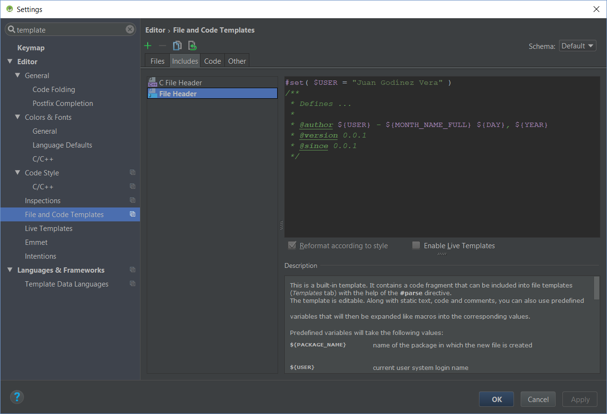

# Gigigo Android MX Guidelines
Guidelines, recommendations, code styles and additional rules for developing new Android MX components.

# 1. Java doc

## 1.1 File header template

You must overwrite the ${USER} variable in the template file with the full author name

Go to __Settings__ -> __File and Code Templates__ -> __Includes__ -> __File Header__ prepend the #set() function call.

Example:



__Template__

```java
#set( $USER = "your name" )
/**
 * Defines ...
 * 
 * @author ${USER} - ${MONTH_NAME_FULL} ${DAY}, ${YEAR}
 * @version 0.0.1
 * @since 0.0.1
 */

```
# 1. Project guidelines

# License
```
Copyright 2017 Gigigo Android Development Team México

Licensed under the Apache License, Version 2.0 (the "License");
you may not use this file except in compliance with the License.
You may obtain a copy of the License at

   http://www.apache.org/licenses/LICENSE-2.0

Unless required by applicable law or agreed to in writing, software
distributed under the License is distributed on an "AS IS" BASIS,
WITHOUT WARRANTIES OR CONDITIONS OF ANY KIND, either express or implied.
See the License for the specific language governing permissions and
limitations under the License.
```
